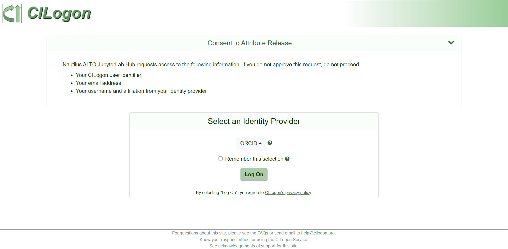
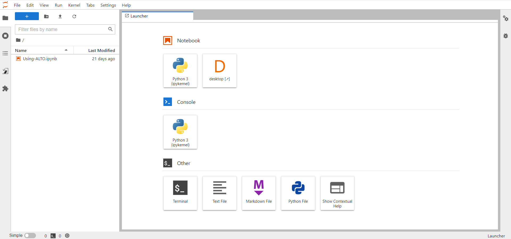

# Environment Setup Guide for Hackathon Developers

*NOTE*: This is a guide for developers participating in the IETF hackathon.
To simplify the development process, we collaborate with Global Network 
Advancement Group (GNA-G) and Pacific Research Platform (PRP) and offer
a Kubernetes platform for the hackathon.

## How to Access the PRP Kubernetes Platform

The platform is accessed through the JupyterHub hosted by PRP. In order to 
access the platform, an account must be set up with the following steps:

1. Contact the administrator (Jensen Zhang <<jingxuan.n.zhang@gmail.com>>) and
   provide an email address which will be used as the username of the platform.
   (Check [issue #1](https://github.com/openalto/ietf-hackathon/issues/1))

   > *NOTE*: The platform uses [CILogon](https://www.cilogon.org/) for
   authorization. Therefore, you should provide your **institutional email**, or
   the email address linked to your **ORCID**, **GitHub**, **Google**, or
   **Microsoft** account.

2. Once the email is confirmed, you can sign up a new account on
   the JupterHub (<https://alto.nrp-nautilus.io/>) using the same email address.

   > *NOTE*: Please make sure the selected identity provider is associated with
   > the provided email address.

   

3. Log in the JupyterHub (<https://alto.nrp-nautilus.io/>) and start a terminal
   or Jupyter Notebook to access the development environment.

   

## How to Work on the PRP Kubernetes Platform

Once you start a terminal in the Jupyterhub, a docker container with
the basic required development environment will be launched.

The container is running Ubuntu 20.04. If you need additional software
packages, you can temporarily install them on the running container. They will
be kept until you restart your container instance. Refreshing the webpage will not
restart the container instance. But logging out and re-logging in will.

If you want to add any additional software package as permanent items, please
make changes to the `Dockerfile` of the
[alto/alto-jupyterlab](https://gitlab.nrp-nautilus.io/alto/alto-jupyterlab)
repo, or contact adminstrators (Jensen Zhang <<jingxuan.n.zhang@gmail.com>>,
John Graham <<jjgraham@ucsd.edu>>).

> *NOTE*: The pre-installed software environment of the current Kubernetes
platform is still working in progess. It can be changed frequently.
